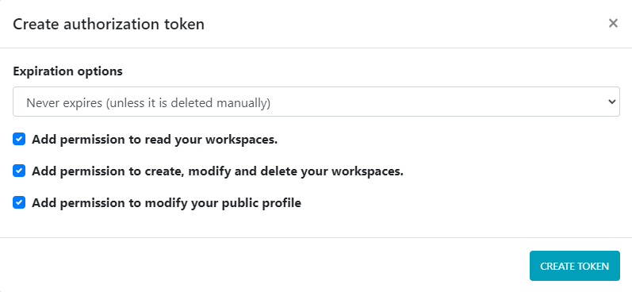

# Deep Intelligence REST API

In order to interact with Deep Intelligence you can use the rest API we provide.

## Documentation

This API is documented with Swagger. Check the documentation here:

 - [https://app.deepint.net/api/v1/documentation/](https://app.deepint.net/api/v1/documentation/)

## Authentication

In order to authenticate within the API, you need an authorization token, in order to create one, go to [Account settings](https://app.deepint.net/o/none?ws=&s=account) and scroll down to the `Authorizations` section.

When creating the token you can restrict the permissions and expiration date.

If the token gets compromised, you can invalidate it by removing it from the `Authorizations` sections.

