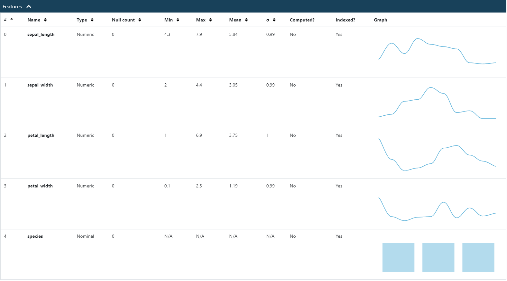
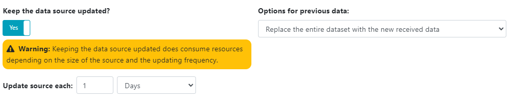

# Data sources

Deep Intelligence data sources are collections of rows used to manage your data, in order to represent it with visualizations or train models with it.

Data sources can be imported from files, URLs, databases and other services. You can check the available options in the source creation menu.

## Data types

Data sources have a defined structure that consist of an ordered set of features. Each feature has its name and it's data type.



Available data types are the following:

 - **Nominal**: Represents a string from 0 to 255 characters. It's used to represent categories.
 - **Text**: Represents a long string. Used to store messages, paragraphs or other texts.
 - **Numeric**: Represents a numeric value, either an integer or a real number.
 - **Logic**: Represents a boolean value. It can be `True` or `False`
 - **Date**: Represents a date or time. By default it's managed in ISO format. However you can change it in case your original data source was encoded with other format. When doing that, use the [MomentJS date formats](https://momentjscom.readthedocs.io/en/latest/moment/04-displaying/01-format/)

## Indexed features

Each feature can be indexed. When indexed, the source size may increase, but the query performance when filtering or sorting by an indexed feature is much better when the number of rows increases a lot.

Note: Indexing features makes the updating process slower. Take that in consideration when creating a source you want to update frequently.

## Auto updating

When creating the source from an online resource, like an URL or a database, you can configure it to automatically update it.



When doing it, the system will automatically create tasks to fetch the new version of the source and replace it or append the new instances, depending on your configuration.

## Updating via API

The preferred method for updating your sources is using the API, since it's the most secure way of automatically transferring your data to Deep Intelligence.

You can update any source by using the instances API:

 - [https://app.deepint.net/api/v1/documentation/#/sources/post_api_v1_workspace__workspaceId__source__sourceId__instances](https://app.deepint.net/api/v1/documentation/#/sources/post_api_v1_workspace__workspaceId__source__sourceId__instances)

## API filtering

When using the API sometimes you are required to input a filter in JSON format, this filter format is used by deep intelligence to filter the data source rows.

A data filter is a tree of nodes, each node can be a group of conditions or a single condition.

A single condition has 3 properties:

 - `left` - Index of the feature to compare
 - `operation` - Condition type
 - `right` - Value to compare, if applicable. For dates, encode them in ISO format. Note: If a condition provides right as a null value and the operation is not `null`, the condition is ignored.

Condition types:

| Condition type | Description | Example |
|---|---|---|
| `null` | Checks if the feature is null  | ``{"type":"one","left":0,"operation":"null"}`` |
| `eq` | Checks if the feature is equals to the provided value  | ``{"type":"one","left":0,"operation":"eq","right":"6.5"}`` |
| `gt` | Checks if the feature greater than the provided value  | ``{"type":"one","left":0,"operation":"gt","right":"6.5"}`` |
| `ge` | Checks if the feature greater than or equals to the provided value  | ``{"type":"one","left":0,"operation":"ge","right":"6.5"}`` |
| `lt` | Checks if the feature lower than the provided value  | ``{"type":"one","left":0,"operation":"lt","right":"6.5"}`` |
| `le` | Checks if the feature lower than or equals to the provided value  | ``{"type":"one","left":0,"operation":"le","right":"6.5"}`` |
| `sw` | Checks if the feature starts with an string.  | ``{"type":"one","left":0,"operation":"sw","right":"string"}`` |
| `swi` | Checks if the feature starts with an string. (Ignore case) | ``{"type":"one","left":0,"operation":"swi","right":"string"}`` |
| `ew` | Checks if the feature ends with an string.  | ``{"type":"one","left":0,"operation":"ew","right":"string"}`` |
| `ewi` | Checks if the feature ends with an string. (Ignore case)  | ``{"type":"one","left":0,"operation":"ewi","right":"string"}`` |
| `cn` | Checks if the feature contains an string.   | ``{"type":"one","left":0,"operation":"cn","right":"string"}`` |
| `cni` | Checks if the feature contains an string. (Ignore case)   | ``{"type":"one","left":0,"operation":"cni","right":"string"}`` |
| `ltd` | For date features, checks the date is before NOW + the provided duration.  | ``{"type":"one","left":4,"operation":"ltd","right":"1m"}`` |
| `gtd` | For date features, checks the date is after NOW - the provided duration.  | ``{"type":"one","left":4,"operation":"gtd","right":"1m"}`` |

For durations in `ltd` and `gtd`, you can send the value followed by the time unit:

```js
var ns = parse('1ns') // => 1 / 1e6
var μs = parse('1μs') // => 1 / 1000
var ms = parse('1ms') // => 1
var s = parse('1s')   // => ms * 1000
var m = parse('1m')   // => s * 60
var h = parse('1h')   // => m * 60
var d = parse('1d')   // => h * 24
var w = parse('1w')   // => d * 7
var y = parse('1y')   // => d * 365.25
```

In order to group conditions, you can use a group node, example:

```json
{
    "type": "allof",
    "children": [
        {"type":"one","left":0,"operation":"gt","right":"1"},
        {"type":"one","left":4,"operation":"eq","right":"setosa"}
    ]
}
```

Types of group nodes:

| Group type | Description |
|---|---|
| `allof` | The condition is true if all of the children conditions are true. If the children array is empty, the condition is always true |
| `anyof` | The condition is true if any of the children conditions is true. If the children array is empty, the condition is always true. |
| `not` |  The condition is true if all of the children conditions are false. If the children array is empty, the condition is always true. |

## Derived sources

You can create derived sources from existing sources, using a filter or another operation.

Derived sources are stored and indexed independently of the parent source, so they will require a task to be updated and also they increase your workspace size.

Currently there are several types of derived sources:

 - **Filter**: Applies a filter and projection to an existing data source.
 - **Join**: Joins two sources. Note: this operation takes a lot fo time for big sources.
 - **Merge**: Merges the instances of two data sources with the same fields.
 - **Melt**: Turns a source with many columns into a source with many rows. This is very useful when representing data.
