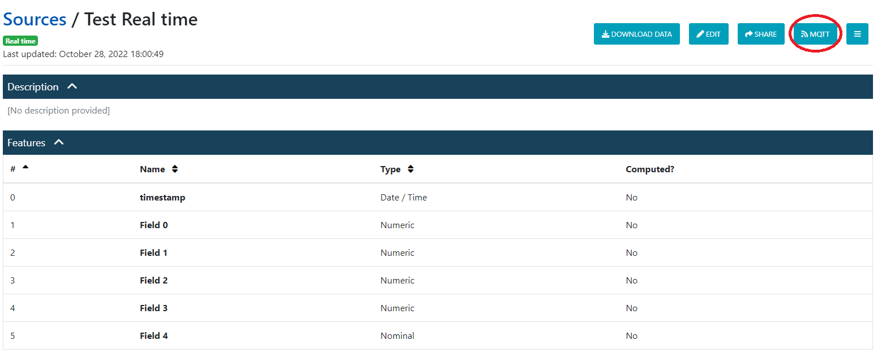
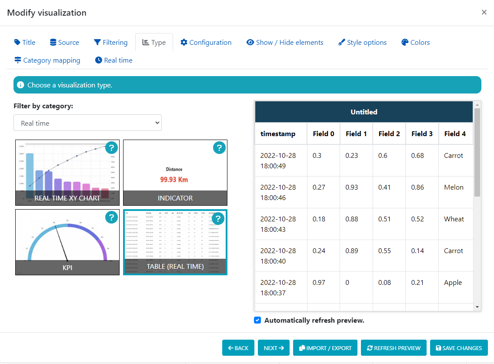
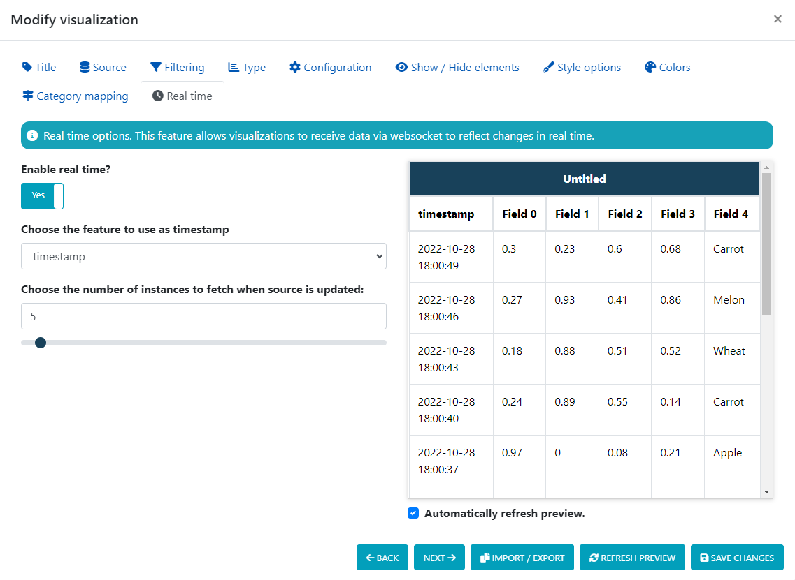

# Real time data sources

External data sources are an alternative to regular data sources when you want real time insertions, instead of the batch task-based system that applies to regular sources.

The main use cases are:

 - To visualize data in real time, using real time visualizations or dashboard monitors.
 - To generate alerts in real time.
 - To predict values in real time using the derived fields and any existing AI models in the workspace.

It is important to know that real time data sources have certain restrictions:

 - They must have a timestamp field, always at the first position.
 - They cannot be indexed by any field, they are always indexed by the timestamp field.
 - The sorting options will be ignored, they are always sorted by timestamp, returning the most recent instances first.
 - They cannot be derived.
 - They cannot be used as an input for training models.

## Real time insertions

In order to insert instances in real time, you have two methods:

### Fist option: Using MQTT

For that, you can get the connection details clicking the `MQTT` button next to the source top bar.

You may insert instances by publishing messages in the given channel, with the given credentials.

Each message must contain a single instance, and it must be JSON encoded as an array, with the data values in order:

 - The timestamp must not be provided, it will be added at the time the server receives the instance.
 - Computed fields must not be provided, those are computed in real time by the server when receiving the instances.

### Second option: Using the API

We provide an HTTP API to do the same function as publishing messages via MQTT.

Check the documentation here (documented with Swagger):

- [https://app.deepint.net/api/v1/documentation/#/sources/post_api_v1_workspace__workspaceId__source__sourceId__real_time_push](https://app.deepint.net/api/v1/documentation/#/sources/post_api_v1_workspace__workspaceId__source__sourceId__real_time_push)

## Clearing data

By default, when creating the real time data source, you can configure the maximum age of the instances before being automatically deleted.

However, this may not be enough. In case you reach the limit for a data source, click the `More options` button (next to the `MQTT` button) and select the option `Clear data`. You will be able to select a range of dates to remove instances.

## Real time visualizations

In order to visualize data in real time, you may use a visualization type inside the `Real time` category. Those visualizations can receive data in real time and smoothly reflect the changes. Any other visualization type will fully refresh when using it with real time data sources.  

You can also [create your own custom real time visualizations](./CUSTOM-VIEW.md#receiving-real-time-data) if you need a fully customizable visualization type that the built-in ones cannot provide.

For receiving data in real time, you must enable the `Real time` option in the last tab of the visualization configuration.

Each time the source is updated, the visualization will receive via WebSocket a certain number of the most recent instances. Depending on how fast your source updates, you may choose a bigger or lower number of instances to receive.

